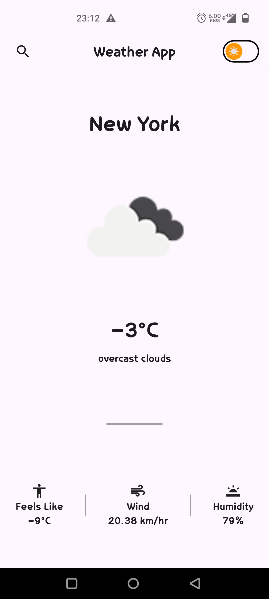
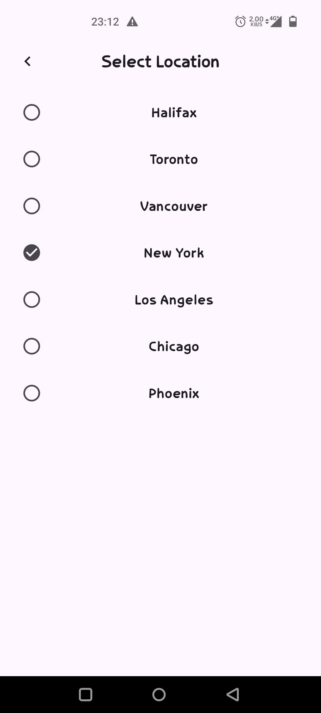
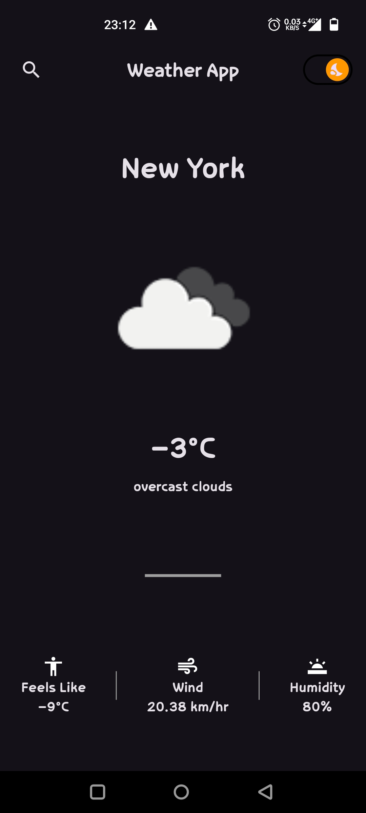
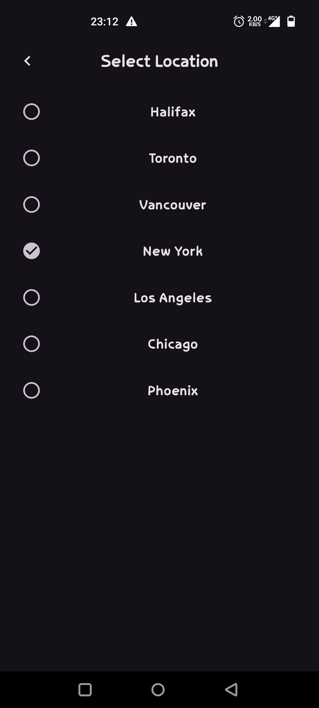

# Weather App using Flutter

This is a simple flutter app created using Flutter.

## Technologies

1. Flutter
2. OpenWeatherMap api
3. Provider (state management)
4. http (for api call)

## Screenshots

### Light Mode

### Dark Mode

